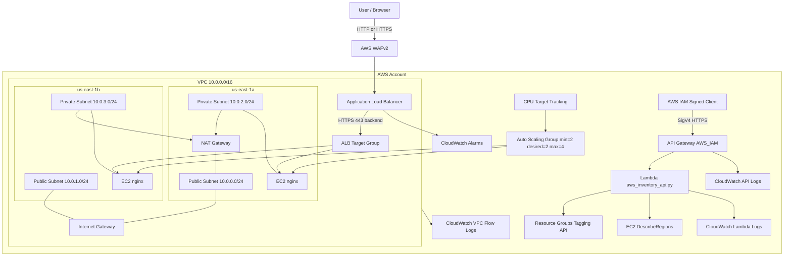

# 365Scores AWS Terraform Infrastructure

Terraform for a production-oriented AWS web application stack for `365scores-idan-webapp`.

The stack is currently destroyed. Running `terraform plan` from this folder shows the resources that would be created from the remote S3 state.

## What It Builds

- VPC in `us-east-1`
- Two public subnets across two Availability Zones
- Two private application subnets across two Availability Zones
- Internet Gateway and public routing
- NAT Gateway egress for private EC2 instances
- Public Application Load Balancer
- EC2 Auto Scaling Group running nginx in private subnets
- HTTPS from ALB to EC2 when `enable_backend_tls = true`
- IAM-secured API Gateway endpoint
- Python Lambda inventory API
- AWS WAFv2 managed rules on the ALB
- CloudWatch logs for Lambda, API Gateway, and VPC Flow Logs
- CloudWatch alarms for ALB 5xx and unhealthy targets
- API Gateway access logs, metrics, throttling, and X-Ray tracing
- Lambda X-Ray tracing and reserved concurrency
- Least-privilege inventory Lambda IAM policy
- S3 remote state with native Terraform locking

## Architecture



## Files

| File | Purpose |
| --- | --- |
| `backend.tf` | S3 remote state backend |
| `versions.tf` | Terraform and provider version requirements |
| `providers.tf` | AWS provider configuration |
| `variables.tf` | Input variables |
| `terraform.tfvars` | Active local values, ignored by git |
| `terraform.tfvars.example` | Shareable example values |
| `network.tf` | VPC, subnets, Internet Gateway, NAT, routing |
| `security_groups.tf` | ALB and EC2 security groups |
| `load_balancer.tf` | ALB, listeners, and target group |
| `compute.tf` | Launch template, ASG, and scaling policy |
| `dns.tf` | Optional Route 53 and ACM resources |
| `inventory_api.tf` | Lambda, IAM, API Gateway, deployment, API settings |
| `observability.tf` | CloudWatch logs, VPC Flow Logs, alarms, API Gateway log role |
| `waf.tf` | AWS WAFv2 web ACL and ALB association |
| `lambda/aws_inventory_api.py` | Python AWS inventory API code |
| `user_data.sh.tftpl` | EC2 bootstrap script for nginx |
| `outputs.tf` | Terraform outputs |

## Remote State

Terraform state is stored in S3:

```text
Bucket: 365scores-idan-webapp-tfstate-577424505362-us-east-1
Key:    365scores-idan-webapp/dev/terraform.tfstate
Region: us-east-1
Locking: Terraform S3 native lockfile
```

Initialize after cloning:

```powershell
terraform init
```

## Configuration

The active local values are in `terraform.tfvars`.

Current hardening defaults include:

```hcl
enable_backend_tls                  = true
enable_waf                          = true
enable_vpc_flow_logs                = true
enable_asg_cpu_scaling              = true
min_size                            = 2
desired_capacity                    = 2
max_size                            = 4
log_retention_days                  = 30
api_throttle_rate_limit             = 20
api_throttle_burst_limit            = 40
lambda_reserved_concurrent_executions = 5
```

Browser-facing HTTPS requires a real domain in Route 53:

```hcl
domain_name    = "app.example.com"
hosted_zone_id = "YOUR_ROUTE53_HOSTED_ZONE_ID"
enable_https   = true
```

The generated ALB DNS name cannot use a trusted ACM certificate directly.

## Deploy

```powershell
terraform init
terraform fmt -recursive
terraform validate
terraform plan
terraform apply
```

## Outputs

After apply:

```powershell
terraform output
terraform output -raw application_url
terraform output -raw inventory_api_url
```

## Validate The Web App

```powershell
$url = terraform output -raw application_url
Invoke-WebRequest -Uri $url -UseBasicParsing
```

Expected result:

```text
StatusCode: 200
```

Check EC2 and target health:

```powershell
$asgName = terraform output -raw autoscaling_group_name
aws autoscaling describe-auto-scaling-groups `
  --auto-scaling-group-names $asgName `
  --region us-east-1 `
  --query "AutoScalingGroups[0].Instances[*].{InstanceId:InstanceId,LifecycleState:LifecycleState,HealthStatus:HealthStatus,AZ:AvailabilityZone}" `
  --output table

$tgArn = aws elbv2 describe-target-groups `
  --region us-east-1 `
  --query "TargetGroups[?contains(TargetGroupName, 'web-')].TargetGroupArn | [0]" `
  --output text

aws elbv2 describe-target-health `
  --target-group-arn $tgArn `
  --region us-east-1 `
  --query "TargetHealthDescriptions[*].{Target:Target.Id,Port:Target.Port,State:TargetHealth.State,Reason:TargetHealth.Reason}" `
  --output table
```

## Validate The Inventory API

The API is secured with `AWS_IAM`. Unsigned browser requests should return `403`.

```powershell
$apiUrl = terraform output -raw inventory_api_url
curl.exe -i $apiUrl
```

Use API Gateway test invoke:

```powershell
$apiUrl = terraform output -raw inventory_api_url
$apiId = ($apiUrl -replace '^https://([^.]*)\..*','$1')
$resourceId = aws apigateway get-resources `
  --rest-api-id $apiId `
  --region us-east-1 `
  --query "items[?path=='/inventory'].id | [0]" `
  --output text

aws apigateway test-invoke-method `
  --rest-api-id $apiId `
  --resource-id $resourceId `
  --http-method GET `
  --region us-east-1
```

## Automated Smoke Test

After `terraform apply`, run the local test tool:

```powershell
python tools/test_stack.py
```

It checks:

- the web application URL returns HTTP `200`
- the inventory API rejects unsigned browser-style requests with `401` or `403`
- API Gateway can invoke the `/inventory` method through AWS CLI credentials

To pass URLs manually:

```powershell
python tools/test_stack.py `
  --web-url "http://your-alb-url" `
  --api-url "https://your-api-id.execute-api.us-east-1.amazonaws.com/dev/inventory"
```

For CI-friendly JSON:

```powershell
python tools/test_stack.py --json
```

## Cost Warning

This production-grade version can create AWS charges. The most important billable resources are:

- Application Load Balancer
- NAT Gateway and NAT data processing
- EC2 instances
- AWS WAFv2
- API Gateway requests
- Lambda invocations
- CloudWatch Logs, metrics, alarms, VPC Flow Logs, and X-Ray

Destroy when finished testing:

```powershell
terraform destroy
```
