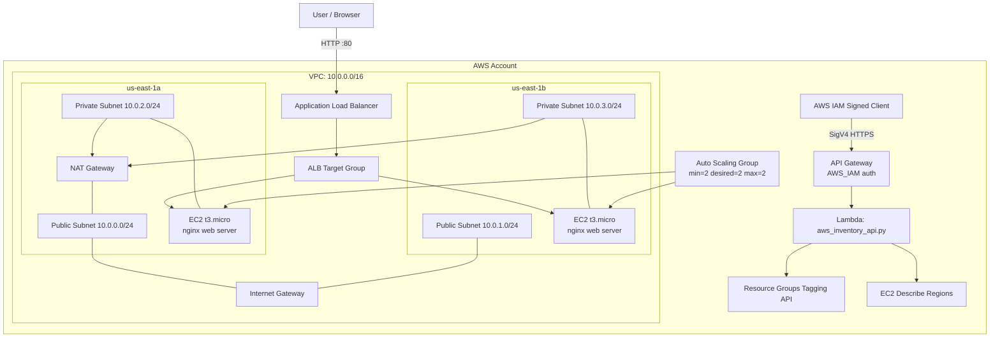

# 365Scores AWS Terraform Infrastructure

This Terraform project deploys a simple AWS web application environment for `365scores-idan-webapp`.

It currently includes:

- A VPC in `us-east-1`
- Two public subnets across two Availability Zones
- Two private application subnets across two Availability Zones
- An Internet Gateway and public route table
- NAT Gateway egress for private EC2 instances
- An Application Load Balancer
- Two `t3.micro` EC2 instances managed by an Auto Scaling Group
- nginx installed on each EC2 instance by user data
- Security groups that allow public HTTP traffic to the ALB and ALB-only traffic to EC2
- An AWS Lambda function written in Python
- An IAM-secured API Gateway endpoint for AWS inventory reporting

## Architecture



## Current Live Outputs

Web application:

```text
http://365scores-idan-webapp-dev-alb-1635444553.us-east-1.elb.amazonaws.com
```

Inventory API:

```text
https://dapa452mth.execute-api.us-east-1.amazonaws.com/dev/inventory
```

The inventory API is secured with `AWS_IAM`. Opening it directly in a browser returns:

```json
{"message":"Missing Authentication Token"}
```

That is expected because normal browser requests are not AWS SigV4 signed.

## Files

| File | Purpose |
| --- | --- |
| `versions.tf` | Terraform and provider version requirements |
| `providers.tf` | AWS provider configuration |
| `variables.tf` | Input variables |
| `terraform.tfvars` | Active local values |
| `network.tf` | VPC, subnets, Internet Gateway, routing |
| `security_groups.tf` | ALB and EC2 security groups |
| `load_balancer.tf` | ALB, listener, and target group |
| `compute.tf` | Launch template and Auto Scaling Group |
| `dns.tf` | Optional Route 53 and ACM resources |
| `inventory_api.tf` | Lambda, IAM role, API Gateway, and deployment |
| `lambda/aws_inventory_api.py` | Python AWS inventory API code |
| `user_data.sh.tftpl` | EC2 bootstrap script for nginx |
| `outputs.tf` | Terraform outputs |

## Prerequisites

- Terraform installed and available on `PATH`
- AWS CLI installed and available on `PATH`
- AWS credentials configured locally
- IAM permissions to manage EC2, VPC, ELB, Auto Scaling, Lambda, IAM, API Gateway, and Resource Groups Tagging API
- Access to the Terraform remote state backend in S3

Verify local AWS credentials:

```powershell
aws sts get-caller-identity
```

## Remote Terraform State

Terraform state is stored remotely in S3 and protected with Terraform's S3 native lockfile.

Backend resources:

```text
S3 bucket:      365scores-idan-webapp-tfstate-577424505362-us-east-1
State key:      365scores-idan-webapp/dev/terraform.tfstate
Region:         us-east-1
```

The S3 bucket has:

- public access blocked
- server-side encryption enabled
- versioning enabled
- native Terraform lockfile support enabled by the backend

If you clone this repository on a new machine, run:

```powershell
terraform init
```

Terraform will connect to the remote backend automatically.

## Configuration

Current active values are in `terraform.tfvars`:

```hcl
aws_region   = "us-east-1"
project_name = "365scores-idan-webapp"
environment  = "dev"

domain_name    = ""
hosted_zone_id = ""
enable_https   = false

instance_type      = "t3.micro"
enable_backend_tls = true
enable_nat_gateway = true
single_nat_gateway = true
min_size           = 2
desired_capacity   = 2
max_size           = 2
```

Custom browser-facing HTTPS is not enabled yet because no real custom domain is configured.

## Deploy

Initialize providers:

```powershell
terraform init
```

Format and validate:

```powershell
terraform fmt -recursive
terraform validate
```

Preview changes:

```powershell
terraform plan
```

Apply changes:

```powershell
terraform apply
```

## Test The Web App

Get the application URL:

```powershell
terraform output application_url
```

Test it from PowerShell:

```powershell
$url = terraform output -raw application_url
Invoke-WebRequest -Uri $url -UseBasicParsing
```

Expected result:

```text
StatusCode: 200
```

Check Auto Scaling instances:

```powershell
aws autoscaling describe-auto-scaling-groups `
  --auto-scaling-group-names 365scores-idan-webapp-dev-asg `
  --region us-east-1 `
  --query "AutoScalingGroups[0].Instances[*].{InstanceId:InstanceId,LifecycleState:LifecycleState,HealthStatus:HealthStatus,AZ:AvailabilityZone}" `
  --output table
```

Check ALB targets:

```powershell
$tgArn = aws elbv2 describe-target-groups `
  --names 365scores-idan-webapp-dev-tg `
  --region us-east-1 `
  --query "TargetGroups[0].TargetGroupArn" `
  --output text

aws elbv2 describe-target-health `
  --target-group-arn $tgArn `
  --region us-east-1 `
  --query "TargetHealthDescriptions[*].{Target:Target.Id,Port:Target.Port,State:TargetHealth.State,Reason:TargetHealth.Reason}" `
  --output table
```

Expected result: both EC2 instances are `healthy`.

## Test The Inventory API

The inventory API endpoint:

```powershell
terraform output inventory_api_url
```

Unsigned browser or curl requests should fail:

```powershell
curl.exe -i https://dapa452mth.execute-api.us-east-1.amazonaws.com/dev/inventory
```

Expected result:

```text
HTTP/1.1 403 Forbidden
{"message":"Missing Authentication Token"}
```

Use API Gateway test invoke:

```powershell
aws apigateway test-invoke-method `
  --rest-api-id dapa452mth `
  --resource-id cnxv4k `
  --http-method GET `
  --region us-east-1
```

For clean JSON output:

```powershell
$result = aws apigateway test-invoke-method `
  --rest-api-id dapa452mth `
  --resource-id cnxv4k `
  --http-method GET `
  --region us-east-1 | ConvertFrom-Json

$result.body | ConvertFrom-Json | ConvertTo-Json -Depth 20
```

Expected output includes:

```json
{
  "services_by_region": {
    "us-east-1": [
      {
        "service": "apigateway",
        "resource_count": 2
      },
      {
        "service": "ec2",
        "resource_count": 10
      },
      {
        "service": "elasticloadbalancing",
        "resource_count": 3
      },
      {
        "service": "lambda",
        "resource_count": 1
      }
    ]
  }
}
```

## HTTPS And TLS Notes

There are two different TLS paths:

- Browser to ALB
- ALB to EC2

Browser-facing HTTPS requires a real domain that you control, such as:

```text
app.example.com
```

Then configure:

```hcl
domain_name    = "app.example.com"
hosted_zone_id = "YOUR_ROUTE53_HOSTED_ZONE_ID"
enable_https   = true
```

The generated AWS ALB DNS name cannot receive a trusted ACM certificate.

Backend TLS support has been prepared with `enable_backend_tls = true`, but the live web stack may still have pending Terraform changes until you apply them. Check with:

```powershell
terraform plan
```

## Cost Warning

This stack can create AWS charges.

Likely billable resources include:

- Application Load Balancer
- NAT Gateway and NAT data processing
- EC2 instances if free-tier hours are exhausted
- API Gateway requests
- Lambda invocations after free-tier limits
- CloudWatch Logs

Destroy the stack when finished testing:

```powershell
terraform destroy
```
